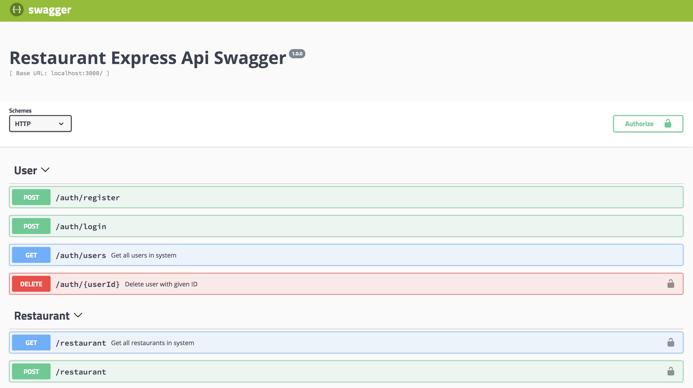
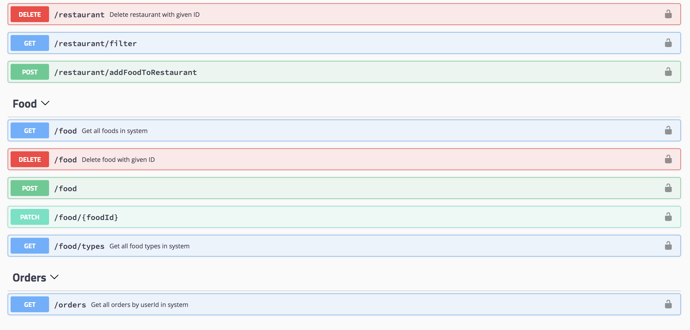
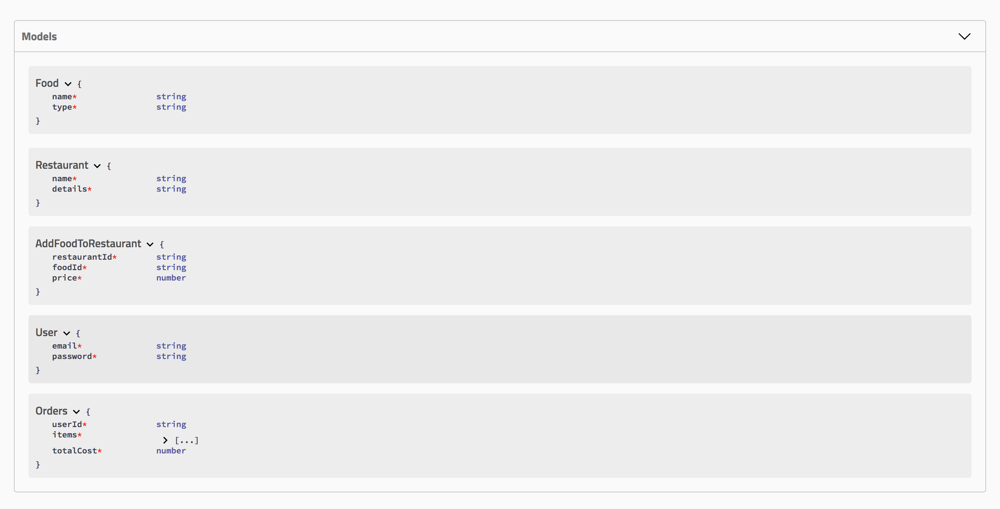

A Boiler plate for REST API using node mongoose express

## Usage
    $ npm install
    $ cp .env.example .env
    $ Connect to Mongo daemon
    $ npm start

Open http://localhost:3000/api-docs/

